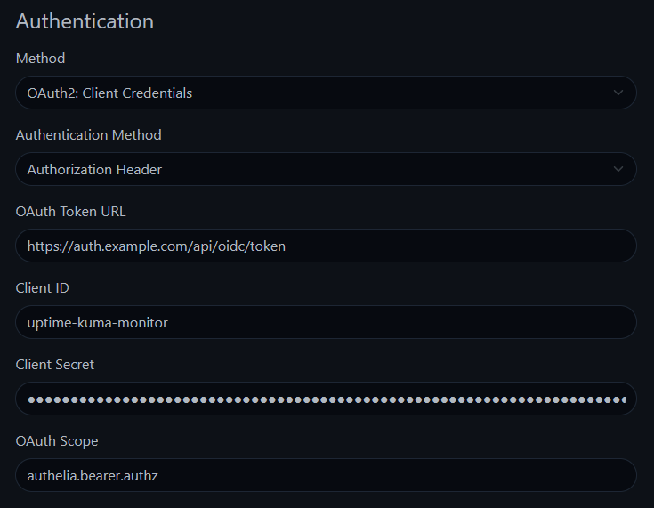

## Tested Versions

* [Authelia]
  * [v4.38.0](https://github.com/authelia/authelia/releases/tag/v4.38.0)
* [Komga]
  * [v1.23.11](https://github.com/louislam/uptime-kuma/releases/tag/1.23.11)

## Before You Begin

{}

### Assumptions

This example makes the following assumptions:

* __Application Root URL:__ `https://uptime-kuma.example.com/`
* __Authelia Root URL:__ `https://auth.example.com/`
* __Client ID:__ `uptime-kuma-monitor`
* __Client Secret:__ `insecure_secret`
* __Secured Ressource URL:__ `https://secure.example.com/`

## Configuration

### Authelia

The following YAML configuration is an example __Authelia__
[client configuration](../../../configuration/identity-providers/openid-connect/clients.md) for use with [Uptime-Kuma]
which will operate with the above example:

```yaml
server:
  endpoints:
    authz:
      forward-auth:
        implementation: 'ForwardAuth'
        authn_strategies:
          - name: 'HeaderProxyAuthorization'
            schemes:
              - Basic
              - Bearer
          - name: 'HeaderAuthorization'
            schemes:
              - Basic
              - Bearer
          - name: 'CookieSession'

access_control:
  rules:
    - domain:
      - "secure.example.com"
      subject:
        - ['oauth2:client:uptime-kuma-monitor']
      policy: one_factor

identity_providers:
  oidc:
    ## The other portions of the mandatory OpenID Connect 1.0 configuration go here.
    ## See: https://www.authelia.com/c/oidc
    clients:
      - client_id: 'uptime-kuma-monitor'
        client_name: 'Uptime-Kuma Monitor'
        client_secret: '$pbkdf2-sha512$310000$c8p78n7pUMln0jzvd4aK4Q$JNRBzwAo0ek5qKn50cFzzvE9RXV88h1wJn5KGiHrD0YKtZaR/nCb2CJPOsKaPK0hjf.9yHxzQGZziziccp6Yng'  # The digest of 'insecure_secret'.
        public: false
        scopes:
          - authelia.bearer.authz
        audience:
          - https://secure.example.com/
        grant_types:
          - client_credentials
        requested_audience_mode: implicit
        token_endpoint_auth_method: client_secret_basic
```
Notes:

- You will need to enable Header Authorization strategy for your [Server Authz Endpoints].
- When you use `implicit` audience mode, you do not need to provide an `audience` in your token request. When using `explicit` audience mode, you will need to provide the specific audience in your request. See [`requested_audience_mode`] - right now Uptime-Kuma does not support setting audience, so you need to keep this at `implicit` for now.
- The `audience` (or multiple) is the endpoints of the secured ressources you want to monitor using Uptime-Kuma
- If you have multiple monitors you can either have multiple clients or add the allowed audiences to the existing client from this example, also make sure to add the additional audiences to access control rules.


### Application

To configure [Uptime-Kuma] to utilize Authelia as an [OpenID Connect 1.0] Provider:

1. Create a new status monitor or configure an existing one
2. Choose monitor type e.g. HTTP(s) Keyword and set a keyword you want to find
3. Set the URL to be monitored (this corresponds to the the `audience` parameter in Authelia)
4. Configure Authentication as follows:  
   - Method: OAuth2: Client Credentials
   - Authentication Method: Authorization Header
   - OAuth Token URL: `https://auth.example.com/api/oidc/token`
   - Client ID: `uptime-kuma-monitor`
   - Client Secret: `insecure_secret`
   - OAuth Scope: `authelia.bearer.authz`

See the following screenshot for an authentication example of the above:



## See Also

* [Uptime-Kuma PR #3119](https://github.com/louislam/uptime-kuma/pull/3119)
* [Authelia](https://www.authelia.com)
* [Uptime-Kuma](https://github.com/louislam/uptime-kuma)

[OpenID Connect 1.0]: ../../openid-connect/introduction.md
[`requested_audience_mode`]: ../../openid-connect/clients/#requested_audience_mode
[Server Authz Endpoints]: ../../miscellaneous/server-endpoints-authz/